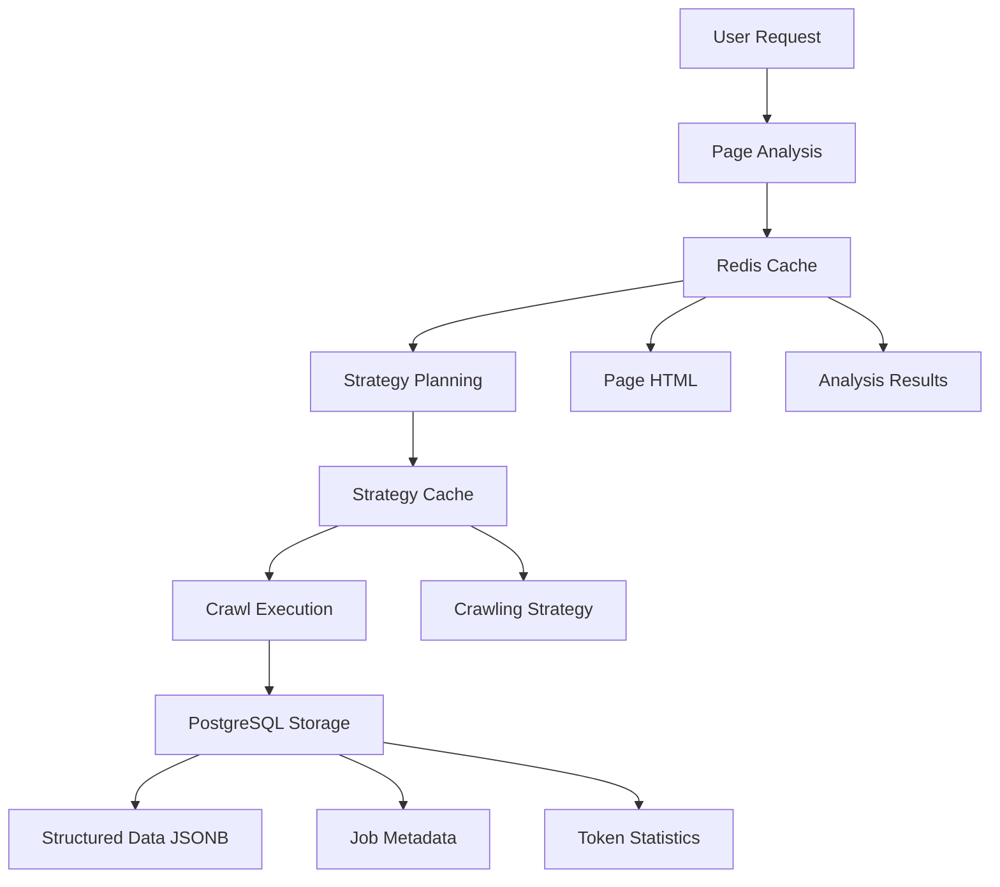

# Intelligent Crawler System

This document describes the enhanced intelligent crawler system that has been added to the Playwright MCP project. The system provides AI-driven web crawling capabilities with automatic page analysis, strategy planning, and optimized data extraction.

## Overview

The intelligent crawler system consists of three main components:

1. **Page Structure Analysis** - Automatically analyzes web pages to identify product containers, pagination patterns, and data fields
2. **Strategy Planning** - Creates optimized crawling strategies based on analysis results and user requirements
3. **Intelligent Execution** - Executes crawling strategies with real-time progress tracking and database storage

## Architecture



## Database Schema

### PostgreSQL Tables

```sql
-- Job tracking
CREATE TABLE crawl_jobs (
    id SERIAL PRIMARY KEY,
    url TEXT NOT NULL,
    strategy_hash TEXT,
    status TEXT DEFAULT 'pending',
    created_at TIMESTAMP DEFAULT NOW(),
    completed_at TIMESTAMP,
    total_pages INTEGER,
    total_items INTEGER,
    input_tokens INTEGER DEFAULT 0,
    output_tokens INTEGER DEFAULT 0,
    total_tokens INTEGER DEFAULT 0
);

-- Results storage
CREATE TABLE crawl_results (
    id SERIAL PRIMARY KEY,
    job_id INTEGER REFERENCES crawl_jobs(id),
    page_number INTEGER,
    extracted_data JSONB,
    metadata JSONB,
    created_at TIMESTAMP DEFAULT NOW()
);

-- Strategy caching
CREATE TABLE crawl_strategies (
    id SERIAL PRIMARY KEY,
    site_pattern TEXT,
    strategy_hash TEXT UNIQUE,
    strategy_data JSONB,
    success_rate FLOAT DEFAULT 0,
    last_used TIMESTAMP DEFAULT NOW()
);
```

### Redis Cache Structure

- `page_analysis:{key}` - Cached page analysis results (1 hour TTL)
- `strategy:{key}` - Cached crawling strategies (24 hours TTL)
- `progress:{jobId}` - Real-time crawling progress (1 hour TTL)

## Configuration

The system requires Redis and PostgreSQL connections. Configure via environment variables:

```bash
# Redis Configuration
REDIS_HOST=localhost
REDIS_PORT=6379
REDIS_PASSWORD=your_password
REDIS_DB=0

# PostgreSQL Configuration
POSTGRES_HOST=localhost
POSTGRES_PORT=5432
POSTGRES_DB=playwright_mcp
POSTGRES_USER=postgres
POSTGRES_PASSWORD=your_password
```

## Available Tools

### 1. browser_analyze_page_structure

Analyzes the current page structure to identify product containers, pagination patterns, and data fields.

**Parameters:**
- `analysisType` (optional): 'quick' or 'detailed' (default: 'detailed')
- `cacheKey` (optional): Custom cache key for storing results
- `userRequirements` (optional): Object containing:
  - `targetDataTypes`: Array of data types to extract (default: ['products', 'titles', 'prices'])
  - `maxPages`: Maximum pages to crawl (default: 10)
  - `prioritizeSpeed`: Whether to prioritize speed over completeness (default: false)
  - `includeImages`: Whether to include image URLs (default: false)

**Example:**
```json
{
  "analysisType": "detailed",
  "userRequirements": {
    "targetDataTypes": ["products", "titles", "prices", "ratings"],
    "maxPages": 5,
    "includeImages": true
  }
}
```

### 2. browser_plan_crawl_strategy

Creates an optimized crawling strategy based on page analysis and user requirements.

**Parameters:**
- `pageAnalysisKey`: Key to retrieve the page analysis from cache
- `userRequirements`: Object containing:
  - `targetDataTypes`: Array of data types to extract
  - `maxPages`: Maximum pages to crawl
  - `prioritizeSpeed`: Whether to prioritize speed over completeness
  - `includeImages`: Whether to include image URLs
  - `budgetTokens` (optional): Maximum token budget for the operation

**Example:**
```json
{
  "pageAnalysisKey": "abc123def456",
  "userRequirements": {
    "targetDataTypes": ["products", "titles", "prices"],
    "maxPages": 10,
    "budgetTokens": 50000
  }
}
```

### 3. browser_execute_intelligent_crawl

Executes a pre-planned crawling strategy with real-time progress tracking and database storage.

**Parameters:**
- `strategyKey`: Key to retrieve the crawling strategy from cache
- `jobName` (optional): Optional name for the crawling job
- `realTimeProgress` (optional): Whether to provide real-time progress updates (default: true)

**Example:**
```json
{
  "strategyKey": "def456ghi789",
  "jobName": "Amazon Product Search - Laptops",
  "realTimeProgress": true
}
```

## Workflow Example

### 1. Analyze Page Structure

First, navigate to a product listing page and analyze its structure:

```json
{
  "tool": "browser_analyze_page_structure",
  "parameters": {
    "analysisType": "detailed",
    "userRequirements": {
      "targetDataTypes": ["products", "titles", "prices", "ratings"],
      "maxPages": 5
    }
  }
}
```

This returns a cache key and detailed analysis of the page structure.

### 2. Plan Crawling Strategy

Use the analysis results to create an optimized crawling strategy:

```json
{
  "tool": "browser_plan_crawl_strategy",
  "parameters": {
    "pageAnalysisKey": "abc123def456",
    "userRequirements": {
      "targetDataTypes": ["products", "titles", "prices", "ratings"],
      "maxPages": 10,
      "budgetTokens": 100000
    }
  }
}
```

This returns a strategy key and detailed crawling plan with cost estimates.

### 3. Execute Crawling

Execute the planned strategy:

```json
{
  "tool": "browser_execute_intelligent_crawl",
  "parameters": {
    "strategyKey": "def456ghi789",
    "jobName": "Product Research - Electronics"
  }
}
```

This executes the crawling strategy and stores results in PostgreSQL.

## Features

### Intelligent Page Analysis

- **Product Container Detection**: Automatically identifies repeating product elements
- **Pagination Pattern Recognition**: Detects button-based, infinite scroll, and URL-based pagination
- **Data Field Mapping**: Identifies titles, prices, images, ratings, and other data fields
- **Site Characteristics**: Determines page type, loading patterns, and estimated content volume

### Smart Strategy Planning

- **Selector Optimization**: Chooses the best CSS selectors based on confidence scores
- **Pagination Configuration**: Automatically configures pagination handling
- **Token Cost Estimation**: Predicts token usage before execution
- **Budget Constraints**: Adjusts strategy to fit token budgets
- **Confidence Scoring**: Provides confidence metrics for strategy reliability

### Adaptive Execution

- **Real-time Progress**: Tracks crawling progress with live updates
- **Error Handling**: Graceful handling of page changes and errors
- **Deduplication**: Removes duplicate items across pages
- **Rate Limiting**: Respects site performance with configurable delays
- **Database Storage**: Stores structured data in PostgreSQL with JSONB columns

### Caching and Performance

- **Redis Caching**: Caches analysis results and strategies for reuse
- **Strategy Reuse**: Reuses successful strategies for similar sites
- **Token Optimization**: Minimizes LLM calls through intelligent caching
- **Batch Operations**: Optimizes database operations for performance

## Token Cost Optimization

The system includes several features to minimize token usage:

1. **Intelligent Caching**: Reuses analysis results and strategies
2. **Selective Analysis**: Focuses on relevant page elements
3. **Strategy Reuse**: Applies successful strategies to similar sites
4. **Budget Controls**: Adjusts crawling scope to fit token budgets
5. **Efficient Extraction**: Uses optimized selectors and minimal data processing

## Error Handling

The system includes comprehensive error handling:

- **Database Connection Failures**: Graceful degradation when databases are unavailable
- **Page Structure Changes**: Adaptive selectors that handle minor page changes
- **Network Issues**: Retry logic for temporary connectivity problems
- **Invalid Selectors**: Fallback mechanisms for broken CSS selectors
- **Rate Limiting**: Automatic backoff when sites implement rate limiting

## Monitoring and Analytics

### Job Tracking

All crawling jobs are tracked with:
- Start and completion times
- Total pages and items processed
- Token usage statistics
- Success/failure status
- Error details and recovery actions

### Performance Metrics

The system tracks:
- Average crawling speed (pages/minute)
- Token efficiency (items/token)
- Strategy success rates
- Cache hit ratios
- Database performance metrics

## Best Practices

### 1. Page Analysis

- Use detailed analysis for complex sites
- Cache analysis results for repeated use
- Specify target data types accurately
- Consider site-specific requirements

### 2. Strategy Planning

- Set realistic token budgets
- Balance speed vs. completeness
- Review confidence scores before execution
- Test strategies on small page counts first

### 3. Crawling Execution

- Use descriptive job names for tracking
- Monitor progress for large jobs
- Respect site terms of service
- Implement appropriate delays between requests

### 4. Data Management

- Regularly clean up old job data
- Monitor database storage usage
- Backup important crawling results
- Index JSONB columns for query performance

## Troubleshooting

### Common Issues

1. **Database Connection Errors**
   - Verify Redis/PostgreSQL are running
   - Check connection credentials
   - Ensure network connectivity

2. **Low Confidence Scores**
   - Try different target data types
   - Use manual selector specification
   - Analyze page structure manually

3. **Token Budget Exceeded**
   - Reduce max pages or elements per page
   - Use more specific selectors
   - Enable aggressive caching

4. **Pagination Not Working**
   - Check for dynamic loading
   - Verify next button selectors
   - Consider infinite scroll detection

### Debug Mode

Enable debug logging by setting environment variables:

```bash
DEBUG=playwright-mcp:crawler
DEBUG_TOKENS=true
DEBUG_DATABASE=true
```

## Future Enhancements

Planned improvements include:

1. **Machine Learning Integration**: Learn from successful crawling patterns
2. **Advanced Deduplication**: Content-based duplicate detection
3. **Distributed Crawling**: Multi-instance crawling coordination
4. **Real-time Monitoring**: Web dashboard for job monitoring
5. **API Integration**: RESTful API for external integrations
6. **Custom Extractors**: User-defined extraction functions
7. **Site-specific Adapters**: Pre-built configurations for popular sites

## Security Considerations

- **Data Privacy**: Ensure compliance with data protection regulations
- **Rate Limiting**: Respect site robots.txt and rate limits
- **Authentication**: Secure database connections with proper credentials
- **Access Control**: Implement user-based access controls for sensitive data
- **Audit Logging**: Track all crawling activities for compliance

## Performance Tuning

### Database Optimization

```sql
-- Optimize query performance
CREATE INDEX CONCURRENTLY idx_crawl_results_extracted_data_gin ON crawl_results USING gin(extracted_data);
CREATE INDEX CONCURRENTLY idx_crawl_jobs_created_at ON crawl_jobs(created_at);
CREATE INDEX CONCURRENTLY idx_crawl_strategies_success_rate ON crawl_strategies(success_rate DESC);
```

### Redis Configuration

```redis
# Optimize for caching workload
maxmemory-policy allkeys-lru
maxmemory 2gb
save 900 1
save 300 10
save 60 10000
```

This intelligent crawler system provides a comprehensive solution for automated web data extraction with AI-driven optimization and robust data management capabilities.
