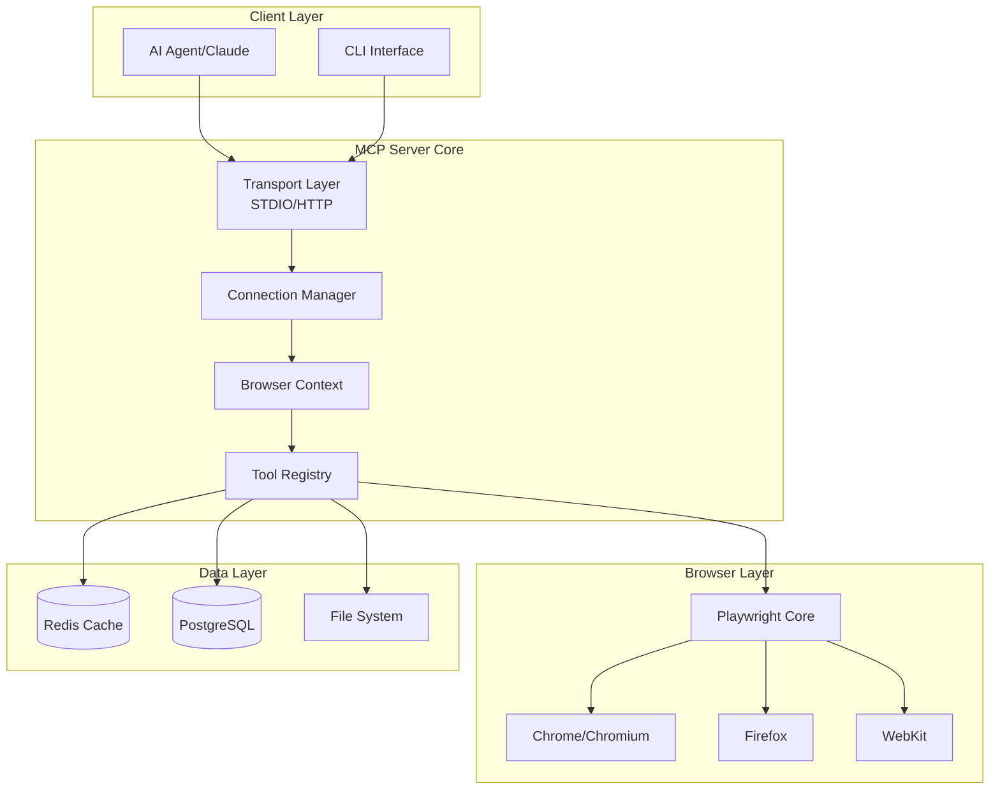
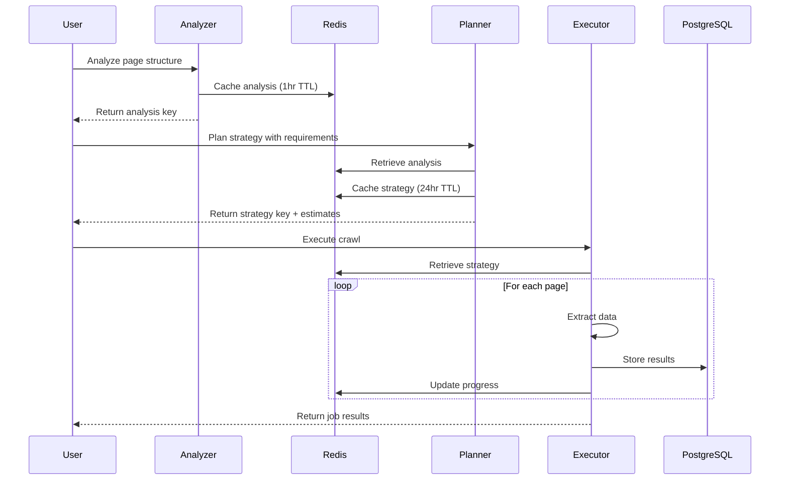
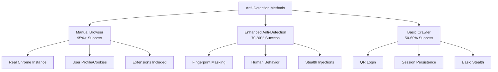
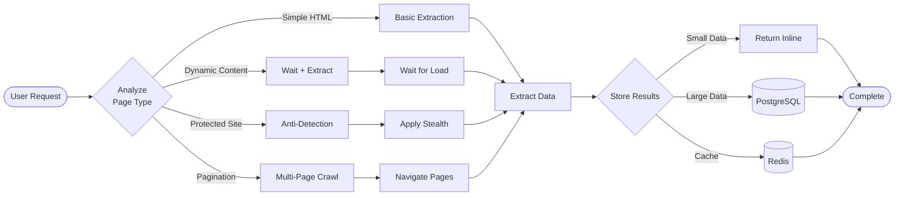

# Playwright MCP Server - Business Specification

## Executive Summary

The Playwright MCP (Model Context Protocol) Server is an enterprise-grade browser automation platform developed by Microsoft that enables AI agents to interact with web browsers through a standardized protocol. Built on the Playwright framework, it provides sophisticated web automation, intelligent crawling, and anti-detection capabilities optimized for modern web applications.

### Core Value Proposition

- **AI-Native Integration**: Designed specifically for AI agents with MCP protocol support
- **Multi-Browser Support**: Chrome, Firefox, WebKit, and Microsoft Edge
- **Intelligent Automation**: AI-driven crawling with automatic pattern recognition
- **Enterprise Features**: Robust error handling, token tracking, and database integration
- **Anti-Detection**: Advanced fingerprinting protection for e-commerce and protected sites

## System Architecture



## Feature Categories

### 1. Browser Management

#### Core Navigation Tools
- **browser_navigate**: Navigate to URLs with intelligent page summarization
- **browser_reload**: Refresh current page
- **browser_navigate_back/forward**: History navigation

#### Tab Management
- **browser_switch_tab**: Switch between multiple browser tabs
- **browser_close_tab**: Close specific tabs by ID
- **browser_close_all_tabs**: Clean up all open tabs
- Automatic tab isolation and context management

#### Visual Capture
- **browser_screenshot**: Full page screenshots
- **browser_screenshot_visible**: Viewport-only screenshots
- **browser_aria_snapshot**: Accessibility tree snapshots
- Multiple format support (PNG, JPEG) with Base64 encoding

### 2. Intelligent Crawler System

#### Architecture Flow



#### Key Components

**Page Structure Analysis** (`browser_analyze_page_structure`)
- Automatic product container detection
- Pagination pattern recognition (button, infinite scroll, URL-based)
- Data field mapping with confidence scores
- Site characteristic profiling
- Redis caching with 1-hour TTL

**Strategy Planning** (`browser_plan_crawl_strategy`)
- AI-optimized selector generation
- Token budget management and cost estimation
- Adaptive configuration based on site patterns
- Confidence scoring for reliability
- Strategy reuse for similar sites

**Crawl Execution** (`browser_execute_intelligent_crawl`)
- Real-time progress tracking via Redis
- Structured data storage in PostgreSQL JSONB
- Automatic deduplication
- Rate limiting and error recovery
- Token usage tracking

### 3. Anti-Detection & E-commerce Features

#### Anti-Detection Hierarchy



#### Enhanced Anti-Detection Features
- **Fingerprint Protection**
  - WebDriver property masking
  - Chrome object mocking
  - WebGL/Canvas fingerprinting bypass
  - Battery/Plugin API spoofing
  - Language/timezone simulation

- **Human Behavior Simulation**
  - Natural mouse movements with Bezier curves
  - Variable typing speeds (40-80 WPM)
  - Random scrolling and reading pauses
  - Tab switching patterns
  - Idle period simulation

- **Shopee-Specific Tools**
  - Manual browser connection support
  - QR code login automation
  - Session state persistence
  - Configurable speed profiles

### 4. Data Extraction & Processing

#### Extraction Tools
- **browser_extract_structured_data**: Schema-based extraction
- **browser_extract_text**: Full text extraction
- **browser_extract_markdown**: Markdown conversion
- **browser_fill_form**: Automated form filling

#### Content Analysis
- **Smart Page Summarization**: 80% output reduction
- **Configurable Verbosity**: quiet/normal/verbose modes
- **Token Tracking**: Real-time usage monitoring
- **Response Management**: Automatic file saving for large outputs

### 5. Testing & Development

#### Testing Capabilities
- **browser_assert_element**: Element presence validation
- **browser_expect_navigation**: Navigation testing
- **browser_trace**: Performance tracing
- **browser_emulate_device**: Mobile device emulation

#### Development Tools
- **browser_eval**: JavaScript execution
- **browser_install**: Playwright installation
- **browser_console**: Console log capture
- **browser_mock_response**: Network mocking

## Crawling Strategies

### Strategy Selection Matrix

| Site Type | Strategy | Success Rate | Speed | Token Usage |
|-----------|----------|--------------|-------|-------------|
| Simple Lists | Basic Extraction | 95%+ | Fast | Low |
| Dynamic SPAs | Wait + Extract | 85% | Medium | Medium |
| Protected Sites | Manual Browser | 95% | Slow | Low |
| E-commerce | Anti-Detection | 70-80% | Slow | High |
| Infinite Scroll | Scroll + Extract | 90% | Medium | Medium |

### Crawling Workflow



## Configuration Options

### CLI Parameters
```bash
mcp-server-playwright [options]

Browser Options:
  --browser <type>           Browser engine (chrome, firefox, webkit, msedge)
  --headless                 Run in headless mode
  --executable-path <path>   Custom browser executable
  --user-data-dir <path>     Browser profile directory
  --isolated                 Use memory-only profile

Network Options:
  --allowed-origins <list>   Semicolon-separated allowed origins
  --blocked-origins <list>   Semicolon-separated blocked origins
  --proxy-server <proxy>     Proxy configuration
  --ignore-https-errors      Ignore HTTPS certificate errors

Performance Options:
  --max-response-size <n>    Max response size before file save (default: 10000)
  --save-responses           Auto-save large responses
  --truncate-responses       Truncate large responses
  --show-tokens              Display token usage statistics

Output Options:
  --quiet                    Minimal output (20 elements max)
  --verbose                  Detailed output (150 elements max)
  --verbosity-level <1-5>    Numeric verbosity level
  --output-dir <path>        Output directory for files
  --save-trace               Save Playwright trace files

Advanced Options:
  --caps <list>              Capabilities (tabs,pdf,history,wait,files,install)
  --device <name>            Device emulation profile
  --viewport-size <size>     Browser viewport dimensions
  --vision                   Use screenshot mode (vs Aria snapshots)
```

### Environment Variables
```env
# Database Configuration
POSTGRES_HOST=localhost
POSTGRES_PORT=5432
POSTGRES_DB=playwright_mcp
POSTGRES_USER=postgres
POSTGRES_PASSWORD=your_password

# Redis Configuration  
REDIS_HOST=localhost
REDIS_PORT=6379
REDIS_PASSWORD=your_password
REDIS_DB=0

# Debug Options
DEBUG=playwright-mcp:*
DEBUG_TOKENS=true
DEBUG_DATABASE=true
```

## Database Schema

### PostgreSQL Tables
```sql
-- Crawl job tracking
CREATE TABLE crawl_jobs (
    id SERIAL PRIMARY KEY,
    url TEXT NOT NULL,
    strategy_hash TEXT,
    status TEXT DEFAULT 'pending',
    created_at TIMESTAMP DEFAULT NOW(),
    completed_at TIMESTAMP,
    total_pages INTEGER,
    total_items INTEGER,
    input_tokens INTEGER DEFAULT 0,
    output_tokens INTEGER DEFAULT 0,
    total_tokens INTEGER DEFAULT 0
);

-- Crawl results storage
CREATE TABLE crawl_results (
    id SERIAL PRIMARY KEY,
    job_id INTEGER REFERENCES crawl_jobs(id),
    page_number INTEGER,
    extracted_data JSONB,
    metadata JSONB,
    created_at TIMESTAMP DEFAULT NOW()
);

-- Strategy caching
CREATE TABLE crawl_strategies (
    id SERIAL PRIMARY KEY,
    site_pattern TEXT,
    strategy_hash TEXT UNIQUE,
    strategy_data JSONB,
    success_rate FLOAT DEFAULT 0,
    last_used TIMESTAMP DEFAULT NOW()
);
```

## Complete Tool Inventory

### Navigation & Browsing (11 tools)
1. `browser_navigate` - Navigate to URL
2. `browser_navigate_back` - Go back in history
3. `browser_navigate_forward` - Go forward in history
4. `browser_reload` - Reload current page
5. `browser_switch_tab` - Switch to specific tab
6. `browser_close_tab` - Close specific tab
7. `browser_close_all_tabs` - Close all tabs
8. `browser_click` - Click elements
9. `browser_hover` - Hover over elements
10. `browser_scroll_down` - Scroll down
11. `browser_scroll_up` - Scroll up

### Data Extraction (8 tools)
12. `browser_extract_structured_data` - Schema-based extraction
13. `browser_extract_text` - Extract all text
14. `browser_extract_markdown` - Convert to Markdown
15. `browser_extract_links` - Extract all links
16. `browser_extract_images` - Extract image URLs
17. `browser_aria_snapshot` - Get accessibility tree
18. `browser_screenshot` - Take screenshots
19. `browser_screenshot_visible` - Screenshot viewport

### Form & Input (6 tools)
20. `browser_fill_form` - Fill form fields
21. `browser_type` - Type text
22. `browser_press` - Press keys
23. `browser_select_option` - Select dropdown options
24. `browser_check` - Check checkboxes
25. `browser_set_files` - Upload files

### Intelligent Crawling (3 tools)
26. `browser_analyze_page_structure` - AI page analysis
27. `browser_plan_crawl_strategy` - Strategy planning
28. `browser_execute_intelligent_crawl` - Execute crawl

### Anti-Detection (6 tools)
29. `browser_shopee_init` - Initialize Shopee crawler
30. `browser_shopee_login` - QR code login
31. `browser_shopee_search` - Search products
32. `browser_launch_chrome_manually` - Manual Chrome launch
33. `browser_connect_to_manual_chrome` - Connect to Chrome
34. `browser_shopee_navigate_manual` - Navigate Shopee

### Testing & Development (8 tools)
35. `browser_assert_element` - Assert element exists
36. `browser_expect_navigation` - Expect navigation
37. `browser_eval` - Execute JavaScript
38. `browser_console` - Get console logs
39. `browser_mock_response` - Mock network responses
40. `browser_wait_for_selector` - Wait for elements
41. `browser_wait_for_text` - Wait for text
42. `browser_trace` - Performance tracing

### Utility Tools (7 tools)
43. `browser_install` - Install Playwright
44. `browser_pdf` - Generate PDFs
45. `browser_emulate_device` - Device emulation
46. `browser_set_viewport` - Set viewport size
47. `browser_clear_cookies` - Clear cookies
48. `browser_dialog_accept` - Handle dialogs
49. `browser_download_file` - Handle downloads

## Performance Characteristics

### Token Usage Optimization
- **Caching Strategy**: 1-hour analysis, 24-hour strategy cache
- **Selective Processing**: Only relevant page sections
- **Batch Operations**: Minimize round-trips
- **Smart Summarization**: 80% output reduction

### Speed Profiles
| Profile | Page Delay | Mouse Speed | Typing WPM | Use Case |
|---------|-----------|-------------|------------|----------|
| fast | 0.1-0.5s | Instant | 200+ | Unprotected sites |
| normal | 1-3s | Fast | 80-120 | General crawling |
| shopee-safe | 3-8s | Natural | 40-80 | E-commerce sites |
| stealth | 5-15s | Human-like | 30-60 | Maximum stealth |

## Known Limitations & Drawbacks

### 1. Technical Limitations
- **Browser Resource Usage**: Each browser instance consumes significant memory (~200-500MB)
- **Concurrent Limitations**: Limited by system resources for parallel operations
- **JavaScript Heavy Sites**: May require longer wait times for dynamic content
- **CAPTCHA Handling**: No automatic CAPTCHA solving (requires manual intervention)

### 2. Anti-Detection Limitations
- **Sophisticated Detection**: Some sites may still detect automation despite stealth measures
- **IP-Based Blocking**: No built-in proxy rotation or IP management
- **Rate Limiting**: Must be manually configured per site
- **Browser Fingerprinting**: Advanced fingerprinting may still identify automation

### 3. Data Management
- **Storage Requirements**: Large crawls require significant PostgreSQL storage
- **Redis Memory**: Cache can grow large with many concurrent operations
- **Token Costs**: AI-driven features consume LLM tokens
- **Network Bandwidth**: Screenshot and page analysis consume bandwidth

### 4. Operational Constraints
- **Setup Complexity**: Requires PostgreSQL and Redis for full features
- **Maintenance**: Database cleanup needed for long-running instances
- **Debugging**: Complex async operations can be difficult to debug
- **Error Recovery**: Some errors may require manual intervention

## Security Considerations

### Data Protection
- Store credentials securely using environment variables
- Implement access controls for database connections
- Regular cleanup of sensitive crawled data
- Compliance with data protection regulations

### Network Security
- Use HTTPS for all external connections
- Implement proxy authentication when required
- Validate and sanitize all user inputs
- Monitor for suspicious crawling patterns

### Browser Security
- Run browsers in sandboxed environments
- Limit file system access permissions
- Regular updates of browser binaries
- Isolate browser profiles between sessions

## Best Practices

### 1. Crawling Ethics
- Respect robots.txt and terms of service
- Implement appropriate rate limiting
- Use descriptive User-Agent strings
- Avoid overwhelming target servers

### 2. Performance Optimization
- Use caching aggressively
- Batch similar operations
- Choose appropriate verbosity levels
- Monitor token usage

### 3. Error Handling
- Implement retry logic with exponential backoff
- Log errors comprehensively
- Use health checks for external services
- Plan for graceful degradation

### 4. Maintenance
- Regular database maintenance and indexing
- Monitor Redis memory usage
- Archive old crawl data
- Update browser versions regularly

## Future Roadmap

### Planned Enhancements
1. **Machine Learning Integration**: Pattern learning from successful crawls
2. **Distributed Crawling**: Multi-instance coordination
3. **Advanced Proxy Management**: Automatic rotation and management
4. **Visual AI Integration**: Image recognition and analysis
5. **Real-time Monitoring Dashboard**: Web-based monitoring interface
6. **Plugin Architecture**: Extensible tool system
7. **Cloud Integration**: Native cloud storage support
8. **API Gateway**: RESTful API for external integration

## Conclusion

The Playwright MCP Server represents a sophisticated browser automation platform that bridges the gap between AI agents and web browsers. With its comprehensive feature set, intelligent crawling capabilities, and robust anti-detection mechanisms, it provides a powerful foundation for web automation, testing, and data extraction tasks. While it has some limitations around resource usage and detection avoidance, its modular architecture and active development make it a valuable tool for organizations requiring programmatic web interaction capabilities.
