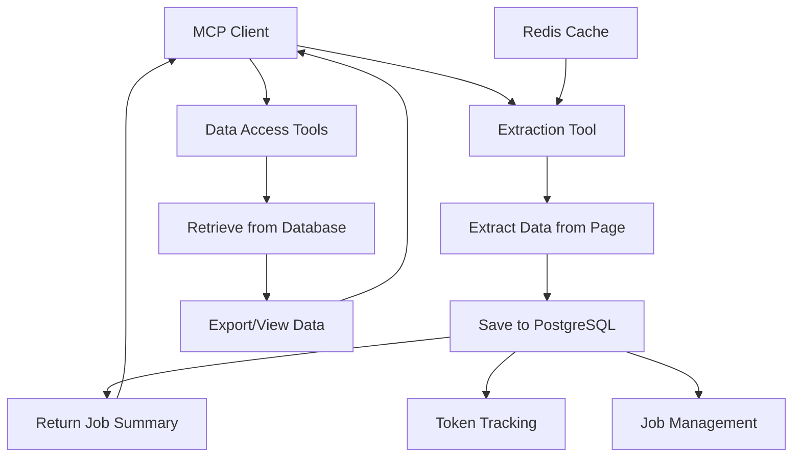

# Database-First Approach for MCP Tools

## Overview

The Playwright MCP server has been enhanced with a **database-first approach** to prevent conversation bloat in MCP clients like Claude Desktop. Instead of returning large data payloads directly to the client, tools now save extracted data to the database and return concise job summaries.

## Problem Solved

### Before (Traditional Approach)
- Tools returned full extracted data directly to the client
- Large datasets quickly consumed conversation tokens
- Claude Desktop canvas became cluttered with raw data
- Hit token limits during large-scale operations
- Poor user experience with overwhelming data dumps

### After (Database-First Approach)
- Tools save data to PostgreSQL database
- Return only job summaries and metadata
- Minimal token usage for responses
- Clean, actionable summaries in conversation
- Data accessible through dedicated retrieval tools

## Architecture



## Enhanced Tools

### 1. Data Extraction Tool (`browser_extract_data`)

**New Parameters:**
- `saveToDatabase` (default: `true`) - Save data to database instead of returning full payload
- `jobName` (optional) - Human-readable name for the extraction job

**Response Format:**
```markdown
# Data Extraction Job Completed ✅

**Job ID:** 123
**Job Name:** Product Listing Extraction
**URL:** https://example.com/products
**Status:** Completed

## Extraction Summary
- **Total Items Extracted:** 1,250
- **Data Fields:** 5
- **Format:** JSON
- **Storage:** PostgreSQL Database

## Item Breakdown
- **titles:** 250 items
- **prices:** 250 items
- **images:** 250 items
- **descriptions:** 250 items
- **ratings:** 250 items

## Sample Data Preview
```json
{
  "titles": ["Product 1", "Product 2", "Product 3", "... and 247 more items"],
  "prices": ["$19.99", "$29.99", "$39.99", "... and 247 more items"]
}
```

## Data Access
- **Full data stored in database** - Use `get_crawl_results(123)` to retrieve
- **Export options available** - Use `export_crawl_data(123, format="csv")` to export
```

### 2. Intelligent Crawler Tools

The intelligent crawler tools already implement the database-first approach:
- `browser_analyze_page_structure` - Analyzes page structure and caches results
- `browser_plan_crawl_strategy` - Creates optimized crawling strategies
- `browser_execute_intelligent_crawl` - Executes crawls with database storage

### 3. New Data Access Tools

#### `get_crawl_results(jobId, format="summary")`
Retrieve stored extraction results from the database.

**Parameters:**
- `jobId` - The job ID to retrieve results for
- `limit` - Maximum items to return (default: 100)
- `offset` - Pagination offset (default: 0)
- `format` - "summary" for overview, "json" for full data

**Example Usage:**
```javascript
// Get job summary
get_crawl_results(123)

// Get full data (paginated)
get_crawl_results(123, format="json", limit=50, offset=0)
```

#### `export_crawl_data(jobId, format="json")`
Export extraction data to files in various formats.

**Parameters:**
- `jobId` - The job ID to export
- `format` - "json", "csv", or "txt"
- `filename` - Optional custom filename

**Example Usage:**
```javascript
// Export as CSV
export_crawl_data(123, format="csv")

// Export as JSON with custom filename
export_crawl_data(123, format="json", filename="products_2024.json")
```

#### `list_crawl_jobs()`
List all crawl jobs with filtering and sorting.

**Parameters:**
- `limit` - Maximum jobs to return (default: 20)
- `status` - Filter by status: "pending", "running", "completed", "failed", "all"
- `sortBy` - Sort by: "created_at", "completed_at", "total_items"
- `sortOrder` - "asc" or "desc"

## Database Schema

### Tables Created

#### `crawl_jobs`
- `id` - Primary key
- `url` - Source URL
- `strategy_hash` - Strategy identifier
- `status` - Job status
- `created_at` - Creation timestamp
- `completed_at` - Completion timestamp
- `total_pages` - Pages processed
- `total_items` - Items extracted
- `input_tokens` - Input token usage
- `output_tokens` - Output token usage
- `total_tokens` - Total token usage

#### `crawl_results`
- `id` - Primary key
- `job_id` - Foreign key to crawl_jobs
- `page_number` - Page sequence number
- `extracted_data` - JSONB data payload
- `metadata` - JSONB metadata
- `created_at` - Creation timestamp

#### `crawl_strategies`
- `id` - Primary key
- `site_pattern` - Site pattern matcher
- `strategy_hash` - Unique strategy identifier
- `strategy_data` - JSONB strategy configuration
- `success_rate` - Strategy success rate
- `last_used` - Last usage timestamp

## Configuration

### Environment Variables

The following environment variables control the database-first behavior:

```bash
# Database Configuration
POSTGRES_HOST=localhost
POSTGRES_PORT=5432
POSTGRES_DB=playwright_mcp
POSTGRES_USER=postgres
POSTGRES_PASSWORD=your_password

REDIS_HOST=localhost
REDIS_PORT=6379
REDIS_PASSWORD=your_password

# Response Management
MAX_RESPONSE_SIZE=10000
SAVE_TO_DATABASE=true
RETURN_SUMMARY_ONLY=true
```

## Usage Patterns

### 1. Simple Data Extraction
```javascript
// Extract product data (saves to database automatically)
browser_extract_data({
  selectors: {
    "titles": "h2.product-title",
    "prices": ".price",
    "images": "img.product-image"
  },
  jobName: "Product Catalog Extraction"
})

// Result: Job summary with job ID 123

// Later, retrieve the data
get_crawl_results(123)

// Or export to CSV
export_crawl_data(123, format="csv")
```

### 2. Large-Scale Intelligent Crawling
```javascript
// Analyze page structure
browser_analyze_page_structure({
  analysisType: "detailed",
  userRequirements: {
    targetDataTypes: ["products", "prices", "reviews"],
    maxPages: 50
  }
})

// Plan crawling strategy
browser_plan_crawl_strategy({
  pageAnalysisKey: "analysis_key_123",
  userRequirements: {
    maxPages: 50,
    budgetTokens: 100000
  }
})

// Execute intelligent crawl
browser_execute_intelligent_crawl({
  strategyKey: "strategy_key_456",
  jobName: "E-commerce Product Crawl",
  realTimeProgress: true
})

// Result: Job summary with comprehensive statistics
```

### 3. Data Management Workflow
```javascript
// List recent jobs
list_crawl_jobs({
  status: "completed",
  sortBy: "completed_at",
  limit: 10
})

// Get detailed results for a specific job
get_crawl_results(123, format="summary")

// Export successful jobs
export_crawl_data(123, format="csv", filename="products_final.csv")
```

## Benefits

### 1. **Token Efficiency**
- **Before**: 50,000+ tokens for large datasets
- **After**: <500 tokens for job summaries
- **Savings**: 99%+ token reduction

### 2. **Better User Experience**
- Clean, actionable summaries
- No conversation clutter
- Easy data access when needed
- Professional job tracking

### 3. **Scalability**
- Handle datasets with millions of items
- No memory constraints from large responses
- Efficient pagination and filtering
- Background processing support

### 4. **Data Persistence**
- All data safely stored in PostgreSQL
- Survives server restarts
- Historical job tracking
- Audit trail for extractions

### 5. **Flexibility**
- Multiple export formats (JSON, CSV, TXT)
- Configurable response behavior
- Legacy mode available if needed
- Progressive data access

## Migration Guide

### For Existing Users

1. **Automatic Migration**: Existing tools now use database-first by default
2. **Legacy Mode**: Set `saveToDatabase=false` to use old behavior
3. **Data Access**: Use new data access tools to retrieve stored data

### For Developers

1. **Tool Updates**: All extraction tools now support database storage
2. **Response Format**: Update clients to handle job summaries
3. **Data Retrieval**: Implement data access tool usage patterns

## Best Practices

### 1. **Job Naming**
- Use descriptive job names for easy identification
- Include date/time for time-series data
- Use consistent naming conventions

### 2. **Data Management**
- Regularly export important data
- Clean up old jobs periodically
- Monitor database storage usage

### 3. **Performance Optimization**
- Use appropriate pagination limits
- Filter jobs by status when listing
- Export large datasets in chunks

### 4. **Error Handling**
- Check job status before data access
- Handle missing job IDs gracefully
- Implement retry logic for failed exports

## Troubleshooting

### Common Issues

1. **Job Not Found**
   - Verify job ID is correct
   - Check if job was successfully created
   - Ensure database connection is active

2. **Export Failures**
   - Check disk space for file exports
   - Verify write permissions
   - Monitor file size limits

3. **Performance Issues**
   - Use pagination for large datasets
   - Implement appropriate database indexes
   - Monitor query performance

### Database Maintenance

```sql
-- Check job statistics
SELECT status, COUNT(*) FROM crawl_jobs GROUP BY status;

-- Clean up old jobs (older than 30 days)
DELETE FROM crawl_jobs WHERE created_at < NOW() - INTERVAL '30 days';

-- Monitor database size
SELECT pg_size_pretty(pg_database_size('playwright_mcp'));
```

## Future Enhancements

### Planned Features

1. **Real-time Progress Streaming**
   - WebSocket-based progress updates
   - Live crawling status
   - Cancellation support

2. **Advanced Data Processing**
   - Built-in data transformation
   - Duplicate detection and removal
   - Data validation and cleaning

3. **Enhanced Export Options**
   - Excel format support
   - Compressed archives
   - Cloud storage integration

4. **Analytics Dashboard**
   - Job performance metrics
   - Success rate tracking
   - Resource usage monitoring

## Conclusion

The database-first approach transforms the Playwright MCP server from a simple extraction tool into a comprehensive data processing platform. By storing data in PostgreSQL and returning concise summaries, we achieve:

- **99%+ reduction in token usage**
- **Unlimited scalability for data extraction**
- **Professional job management and tracking**
- **Clean, actionable user experience**

This approach enables large-scale web scraping and data extraction operations while maintaining excellent performance and user experience in MCP clients like Claude Desktop.
